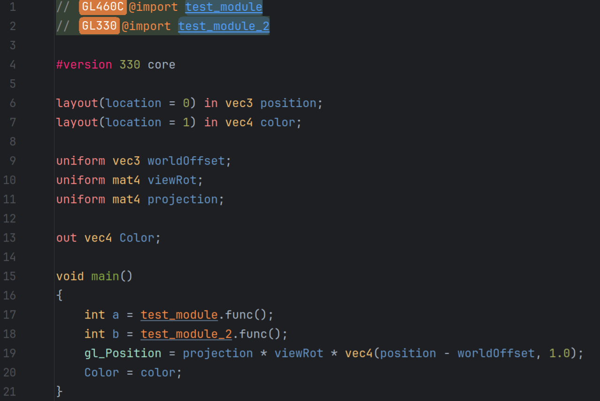
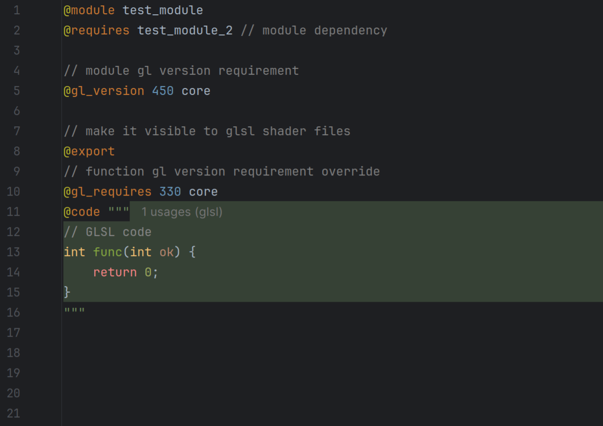

# Kirino Shader Meta Language Support

<!-- Plugin description -->
This is the IntelliJ support of Kirino Shader Meta Language (KSML) for GLSL.

KSML is a runtime-agnostic engineering layer for GLSL. 
Unlike engine-specific shader systems, it's non-invasive and also provides 
modules, namespaces, and first-class IDE support.

**GLSL**

**KSML**

KSML plugin is designed to **_not_** provide the GLSL syntax and work with a third party GLSL plugin, 
currently the GLSL plugin by Roi Mordechay. 
Specifically, KSML plugin only provides its meta directive related IDEA features, like syntax highlighting, navigation, etc.
AND it injects GLSL syntax into KSML code blocks as well as injects KSML meta directive syntax into GLSL shader files.

> **Note**:
> You can find a less buggy version of the GLSL plugin (Roi Mordechay) [here](https://github.com/tttsaurus/glsl-plugin-idea).
>  Unfortunately, there are no better GLSL plugins to support at the moment.

## Features
- Real-time function call precondition analysis
- Code completion
- Go to declaration
- Find usages (usage UI inlay support)
- Rename function declaration and all occurrences

## IDEA Versions

KSML plugin explicitly supports (runs `verifyPlugin`):
- IDEA 2025.2.6.2
- IDEA 2025.1.7.1
- IDEA 2024.3.7.1
- IDEA 2024.2.6
- IDEA 2024.1.7

Older or newer versions will likely to be compatible too.

<!-- Plugin description end -->

## Dev Env / Build

- Import the build script and download deps
- Install the plugin `Grammar-Kit` **_2023.3.2_** by JetBrains
- Install the plugin `Plugin DevKit` by JetBrains

**Dev Tips**
- `./gradlew runIde` to start a sandbox IDE instance
  - Install the plugin `GLSL` by Roi Mordechay in your sandbox IDE (this is a hard dep)
- `./gradlew build` (saves jars to `build/libs`)
- `./gradlew verifyPlugin` to verify the plugin (see reports at `build/reports/pluginVerifier`)
- `./gradlew test` to run tests

**Update Parser & Lexer**
- Modify `src/main/grammar/ksml.bnf` to update BNF
- Update parser code `src/main/java/...`: 
  Right Click `ksml.bnf` ⟶ Open Menu ⟶ `Generate Parser Code`
- Update lexer code `src/main/java/...`: 
  Right Click `ksml.bnf` ⟶ Open Menu ⟶ `Generate JFlex Lexer` ⟶ Save to `src/main/grammar/__KsmlLexer.flex`
  ⟶ Right Click `__KsmlLexer.flex` ⟶ Open Menu ⟶ `Run JFlex Generator`
- `./gradlew patchGrammarKit` to apply patches to Java code generated by GrammarKit
